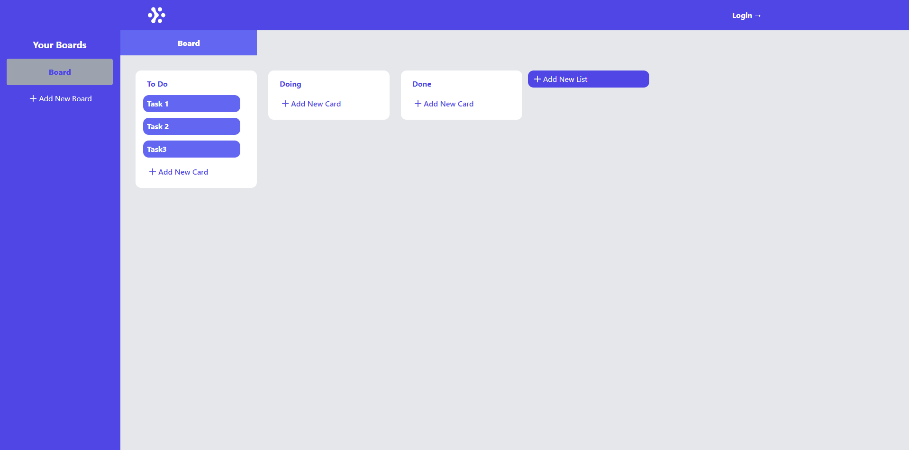

# Project Title
TaskTrackerFrontend

## Description

TaskTrackerFrontend is a React-based application styled with Tailwind CSS. It serves as a robust task manager enabling users to efficiently organize their activities. The application offers an intuitive interface with lists and cards that can be smoothly slid and sorted according to user preferences.

Key Features:

Task Management: Users can effortlessly create, edit, and delete tasks.
Customizable Lists and Cards: The application provides flexibility in creating personalized lists and organizing tasks into cards that can be moved and reordered as needed.
User Authentication: TaskTrackerFrontend features an authentication system allowing users to register and log in securely to access their data.
Automatic Data Saving: With automatic saving functionality, users' tasks and preferences are continually saved, ensuring no progress is lost.
Data Storage: Each user has their own storage space to securely store their tasks and preferences.
With TaskTrackerFrontend, task management becomes a seamless and effective experience, giving users complete control over their daily productivity.




## Getting Started

### Dependencies

* Describe any prerequisites, libraries, OS version, etc., needed before installing program.
* ex. Windows 10

### Installing

* How/where to download your program
* Any modifications needed to be made to files/folders

### Executing program

* How to run the program
* Step-by-step bullets
```
code blocks for commands
```

```